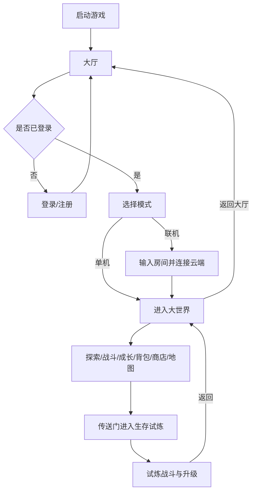
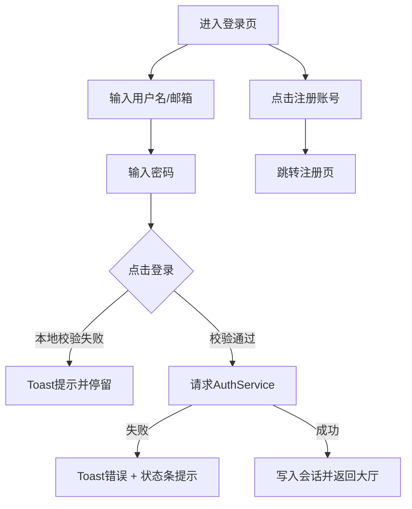

# moe_world 流程与 UI 设计蓝图（基于现有可实现）

本文档用于对齐三件事：
- 先用设计稿把流程和界面做完整。
- 再基于当前 Godot 4.4 项目快速落地开发。
- 明确你（美术/音频）与我（代码/逻辑/UI实现）各自职责边界。

---

## 1. 现状检查结论（可直接复用）

当前项目已经有可用基础，不需要推倒重来：

- 流程骨架已通：`HallScene` -> `Login/Register` -> `WorldScene` -> `SurvivorArena` -> 回大厅。
- 大厅 UI 已有完整信息架构：模式选择、账号状态、快捷入口、联机房间输入。
- 世界 HUD 已有核心模块：顶栏、地图、聊天、背包、商店、成长、移动端控件。
- 登录/注册页面已成体系：主卡片结构、状态提示、服务器状态条。
- 个人中心和多个 Overlay 已落地：背包、商店、地图、成长面板。

结论：当前最适合做的是“在已有结构上统一视觉和交互规范”，而不是大改架构。

---

## 2. 产品流程（目标完整闭环）



---

### 2.1 架构原则（中文注释）

- **同核异皮**：大世界与试炼共用同一套玩法核心（移动、攻击、成长、输入、数值）。
- **场景差异化**：两者只在场景资源、刷怪规则、胜负条件、结算流程上不同。
- **落地建议**：后续实现按“共用逻辑 + 模式参数（World/Trial）”推进，避免维护两套代码。

## 3. 页面级设计说明（给设计师出图）

设计师出图建议按以下 6 个页面模板输出，每个模板都给 PC 和移动端两套版式。

> 注：文档中出现的 `MainCard`、`TopBar` 等英文名称为**现有节点名**，用于和 Godot 场景一一对应；其余说明尽量使用中文表述，便于设计与开发统一沟通。

### 3.1 大厅
- 目标：账号状态清晰、模式选择清晰、操作入口集中。
- 关键区块：
  - 左侧品牌与玩家信息。
  - 中/右侧模式卡片（单机/联机）。
  - 底部功能入口（个人中心/成长/登录状态按钮）。
- 状态稿：
  - 游客态（未登录）。
  - 已登录态（可联机）。
  - 联机连接中/成功/失败反馈态。

#### 3.1.1 大厅线框（PC 1280 基准）

```text
+--------------------------------------------------------------------------------------------------+
| 顶部品牌区（HeroStrip）：品牌标题 / 副标题 / 账号状态徽章                                        |
|--------------------------------------------------------------------------------------------------|
| +-------------------------------+  +----------------------------------------------------------+ |
| | 左侧信息栏                    |  | 右侧玩法主舞台                                           | |
| |-------------------------------|  |----------------------------------------------------------| |
| | 玩家信息区（PlayerInfoBar）   |  | 标题与提示（SectionTitle / SectionHint）                | |
| | [头像][昵称][在线时长][快捷键] |  |----------------------------------------------------------| |
| |                               |  | [单机模式卡]                [联机模式卡]                | |
| | (中间留白用于装饰粒子)         |  | [图标/说明/进入世界]        [图标/说明/房间输入/联机]   | |
| |-------------------------------|  |----------------------------------------------------------| |
| | 功能入口区（FeaturesSection）  |  | 页脚（Footer）：© 2026 moe world                         | |
| | [个人中心][成长][登录/退出]    |  |                                                          | |
| +-------------------------------+  +----------------------------------------------------------+ |
+--------------------------------------------------------------------------------------------------+
```

#### 3.1.2 大厅线框（移动端 390 基准）

```text
+--------------------------------------+
| 顶部品牌区（压缩）                    |
| [标题] [状态徽章]                    |
|--------------------------------------|
| 玩家信息区                            |
| [头像 昵称 在线时长]                 |
| [快捷按钮3个]                        |
|--------------------------------------|
| 单机模式卡                            |
| [icon][说明][进入世界]               |
|--------------------------------------|
| 联机模式卡                            |
| [icon][说明][房间输入][连接云端]      |
|--------------------------------------|
| 功能入口区                            |
| [个人中心][成长][登录/退出]           |
+--------------------------------------+
```

#### 3.1.3 节点映射（`HallScene.tscn`）

- 背景层：`BgGradient`、`BubbleParticles`、`SakuraParticles`
- 主容器：`MainContainer`
- 头部：`HeroStrip`
- 玩家信息：`PlayerInfoBar`
- 模式区：`GameModesSection/GameModesGrid`
- 功能区：`FeaturesSection`
- 状态与成长弹层：`CharacterBuildOverlay`

### 3.2 登录 / 注册
- 目标：输入流程干净、错误反馈明确、回跳路径简洁。
- 关键区块：
  - 中央主卡（输入+主按钮）。
  - 底部状态条（服务器状态）。
  - 顶部轻装饰层（不影响可读性）。
- 状态稿：
  - 空表单、校验失败、请求中、成功跳转。

#### 3.2.1 登录页线框（PC 1280 基准）

```text
+--------------------------------------------------------------------------------------------------+
|                                      背景渐变 / 粒子层                                          |
|                                                                                                  |
|                                                                                                  |
|                              +--------------------------------------+                            |
|                              |               主卡片（MainCard）     |                            |
|                              |--------------------------------------|                            |
|                              |               主标题（TitleMain）    |                            |
|                              |                 "萌"                 |                            |
|                              |--------------------------------------|                            |
|                              |               副标题（TitleSub）     |                            |
|                              |             "moe world"             |                            |
|                              |--------------------------------------|                            |
|                              |            账号输入（UsernameInput） |                            |
|                              |        [ 用户名 / 邮箱输入框 ]       |                            |
|                              |--------------------------------------|                            |
|                              |            密码输入（PasswordInput） |                            |
|                              |          [ 密码输入框(密文) ]        |                            |
|                              |--------------------------------------|                            |
|                              |               登录按钮（LoginBtn）   |                            |
|                              |               [ 登录 ]               |                            |
|                              |--------------------------------------|                            |
|                              |   忘记密码      注册账号              |                            |
|                              |   [忘记密码?]       [注册账号]        |                            |
|                              +--------------------------------------+                            |
|                                                                                                  |
|    +----------------------------------------------------------------------------------------+    |
|    | 状态点 + 状态文案：检查服务器... / 在线 / 离线 / 重试中                               |    |
|    +----------------------------------------------------------------------------------------+    |
+--------------------------------------------------------------------------------------------------+
```

#### 3.2.2 登录页线框（移动端 390 基准）

```text
+--------------------------------------+
|            背景渐变 / 粒子            |
|                                      |
|   +------------------------------+   |
|   |         主卡片（MainCard）   |   |
|   |------------------------------|   |
|   |  TitleMain "萌"              |   |
|   |  TitleSub  "moe world"       |   |
|   |------------------------------|   |
|   | 账号输入（UsernameInput）     |   |
|   | [ 用户名/邮箱 ]              |   |
|   |------------------------------|   |
|   | 密码输入（PasswordInput）     |   |
|   | [ 密码 ]                     |   |
|   |------------------------------|   |
|   | [ 登录 ]                     |   |
|   |------------------------------|   |
|   | [忘记密码?]  [注册账号]       |   |
|   +------------------------------+   |
|                                      |
| +----------------------------------+ |
| | ● 服务器状态文案（简写）         | |
| +----------------------------------+ |
+--------------------------------------+
```

#### 3.2.3 布局尺寸建议（直接可开发）

- `MainCard`：
  - PC：宽 `920~1040`，高 `640~720`（当前场景已接近可用）。
  - Mobile：宽度占屏 `88~92%`，高度自适应，底部预留状态条安全区。
- 输入区：
  - 输入框高 `56~64`。
  - 输入块间距 `12~16`。
  - 主按钮高 `56~64`，与输入区保持同宽。
- 底部状态条：
  - 高度 `44~52`。
  - 文案居中，状态点靠左，颜色按在线/离线/重试变化。

#### 3.2.4 节点映射（基于现有 `LoginScreen.tscn`）

- 背景层：`BgGradient` + `Vignette` + `SakuraParticles`
- 主卡：`MainCard/CardContent`
- 输入链路：`UsernameInput` -> `PasswordInput` -> `LoginBtn`
- 辅助入口：`ForgetPwdBtn`、`RegisterBtn`
- 状态区：`ServerStatusStrip/ServerStatusBar/StatusDot/StatusLabel`
- 通知：`ToastPanel/ToastLabel`（用于错误、成功、网络提示）

#### 3.2.5 交互流（登录页）



#### 3.2.6 注册页线框（PC/移动端，复用登录结构）

```text
PC（示意）:
[MainCard]
  [Title: 注册账号]
  [UsernameInput]
  [EmailInput]
  [PasswordInput]
  [ConfirmInput]
  [RegisterBtn]
  [LoginLinkBtn]

移动端（示意）:
[MainCard]
  [标题]
  [4个输入框纵向]
  [主按钮]
  [返回登录链接]
```

注册页节点映射（`RegisterScreen.tscn`）：
- 主卡：`MainCard/CardContent`
- 输入链路：`UsernameInput -> EmailInput -> PasswordInput -> ConfirmInput`
- 主动作：`RegisterBtn`
- 回跳动作：`LoginLinkBtn`
- 通知层：`ToastPanel/ToastLabel`

### 3.3 大世界 HUD
- 目标：战斗信息、导航信息、入口按钮并存但不遮挡操作。
- 关键区块：
  - 顶栏：返回/退出、成长/背包/商店/地图、HP、在线数、昵称、提示文案。
  - 右上：雷达/时钟。
  - 左下/右下：移动端摇杆与攻击键（移动端）。
- 状态稿：
  - 单机战斗态。
  - 联机探索态。
  - 打开地图/背包/商店时的叠层关系。

#### 3.3.1 世界HUD线框（PC 1280）

```text
+--------------------------------------------------------------------------------------------------+
| TopBar: [返回大厅][退出游戏][成长][背包][商店][地图] [HP] [在线] [提示] [昵称]                   |
|--------------------------------------------------------------------------------------------------|
|                                                                                                  |
|                                  世界场景可视区域（Playfield）                                   |
|                                                                                                  |
|                                                                          [RadarMinimap]         |
|                                                                          [HudClock]             |
|                                                                                                  |
| [WorldChat]                                                                        [MobileControls]
+--------------------------------------------------------------------------------------------------+
```

#### 3.3.2 世界 HUD 线框（移动端 390）

```text
+--------------------------------------+
| TopBar(压缩)                          |
| [返回][地图][HP/在线简写][昵称]        |
|--------------------------------------|
|               Playfield               |
|                                      |
|   [WorldChat(折叠)]   [RadarMini]    |
|                                      |
| [Joystick]          [攻击][技能][交互] |
+--------------------------------------+
```

#### 3.3.3 节点映射（`WorldGameplayHud.tscn`）

- 顶栏：`TopBar/*`
- 时间与雷达：`HudClock`、`RadarMinimap`
- 移动端控件：`MobileControls`
- 聊天：`WorldChat`
- 叠层：`BackpackOverlay`、`CharacterBuildOverlay`、`WeaponShopOverlay`、`WorldMapOverlay`

### 3.4 Overlay（背包/商店/地图/成长）
- 目标：统一弹层体系和关闭逻辑，减少学习成本。
- 统一规范建议：
  - Dim 背景透明度统一。
  - 弹层圆角、标题、关闭按钮位置统一。
  - 可滚动区与操作区分层明确。
- 必要状态稿：
  - 空内容态（如背包为空）。
  - 内容多滚动态（背包/商店）。
  - 成长点不足/可分配两种态。

#### 3.4.1 弹层（Overlay）通用线框

```text
+--------------------------------------------------------------------------------------------------+
| 全屏遮罩（Dim）                                                                                   |
|             +--------------------------------------------------------------------+               |
|             | 中央面板（CenterPanel / MapCard）                                   |               |
|             | [标题]                                                             |               |
|             |--------------------------------------------------------------------|               |
|             | [可滚动内容区 / 地图绘制区 / 属性面板]                              |               |
|             |                                                                    |               |
|             |--------------------------------------------------------------------|               |
|             | [主操作按钮] [关闭按钮]                                             |               |
|             +--------------------------------------------------------------------+               |
+--------------------------------------------------------------------------------------------------+
```

#### 3.4.2 Overlay 节点映射

- 背包：`BackpackOverlay`（`Dim` + `CenterPanel` + `Scroll` + `CloseBtn`）
- 商店：`WeaponShopOverlay`（`Grid` 商品网格）
- 地图：`WorldMapOverlay`（`MapCard` + `MinimapDrawer`）
- 成长：`CharacterBuildPanel2`（职业切换、属性、技能、加点）

### 3.5 个人中心（Profile）
- 目标：信息展示为主，操作入口为辅，避免过重功能。
- 关键区块：
  - 头像与基础信息。
  - 数据卡片（等级/经验/金币等）。
  - 标签切换区（资料/成就/收藏/设置）。
- 状态稿：
  - 游客态简版。
  - 登录态完整版。

#### 3.5.1 个人中心线框（PC 1280）

```text
+--------------------------------------------------------------------------------------------------+
| HeaderBar: [返回] [个人中心]                                                                      |
|--------------------------------------------------------------------------------------------------|
| ProfileCard                                                                                       |
|  +----------------------+  +------------------------------------------------------------------+  |
|  | AvatarSection        |  | InfoSection                                                      |  |
|  | [头像圈][昵称][UID]  |  | [StatsGrid: 等级/经验/金币/签到/好友]                            |  |
|  |                      |  | [TabButtons: 资料/成就/收藏/设置]                               |  |
|  |                      |  | [TabContentScroll]                                               |  |
|  +----------------------+  +------------------------------------------------------------------+  |
|--------------------------------------------------------------------------------------------------|
| ActionButtons: [修改资料] [账号安全] [返回大厅]                                                   |
+--------------------------------------------------------------------------------------------------+
```

#### 3.5.2 个人中心线框（移动端 390）

```text
+--------------------------------------+
| HeaderBar [返回][标题]                |
|--------------------------------------|
| AvatarSection                         |
| [头像][昵称][UID]                     |
|--------------------------------------|
| StatsGrid(2列或1列)                   |
|--------------------------------------|
| TabButtons(可横向滚动)                |
|--------------------------------------|
| TabContentScroll                      |
|--------------------------------------|
| [修改资料][账号安全][返回大厅]         |
+--------------------------------------+
```

#### 3.5.3 节点映射（`ProfileScene.tscn`）

- 头部：`HeaderBar/HeaderContent`
- 资料卡：`ProfileCard/ProfileContent`
- 统计区：`InfoSection/StatsGrid`
- 标签区：`TabButtons` + `TabContentScroll`
- 底部操作：`ActionButtons`

### 3.6 生存试炼 HUD（补齐出图）
- 目标：与大世界视觉统一，但强调“副本压力感”。
- 关键区块：
  - 波次、生存时间、当前等级、回城按钮、移动端战斗键。
- 状态稿：
  - 开局态、升级弹面板态、低血量高压态、结算返回态。

#### 3.6.1 生存试炼 HUD 线框（建议）

```text
+--------------------------------------------------------------------------------------------------+
| 试炼顶栏（TopBar）: [返回大世界] [波次] [生存时间] [等级/经验] [生命]                             |
|--------------------------------------------------------------------------------------------------|
|                                                                                                  |
|                                  试炼战斗区（刷怪+技能）                                          |
|                                                                                                  |
| [提示/掉落/飘字]                                                                 [小地图可选]      |
|                                                                                                  |
| [移动摇杆]                                                             [攻击][技能][交互]        |
+--------------------------------------------------------------------------------------------------+
```

#### 3.6.2 节点落地说明

- 复用世界控件风格：`MobileGameplayControls.tscn`
- 升级弹层复用：`CharacterBuildPanel.tscn`（试炼模式入口）
- 需要设计稿补齐：波次条样式、倒计时样式、结算面板样式

---

## 4. 布局与交互规范（先定规矩再开发）

### 4.1 布局栅格建议
- 设计基准宽度：PC `1280`，移动端宽度 `360/390` 两档。
- 安全边距：
  - PC：左右 `24`，上下 `16~24`。
  - 移动端：左右 `12~16`，上下 `12`。
- 弹层最大宽度：
  - 中型面板 `600~780`。
  - 大型面板 `860~960`。

### 4.2 交互优先级
- 世界中优先级建议：
  - `地图/模态弹窗` > `对话` > `角色操作`。
- 统一输入原则：
  - 有模态弹层时，不触发世界攻击/交互。
  - 移动端按钮与摇杆支持多指并发。

### 4.3 视觉风格基线
- 当前项目已采用“深紫/蓝 + 玻璃质感卡片”方向，建议延续。
- 统一视觉变量（token，由设计稿提供）：
  - 主色/辅色/危险色/成功色。
  - 角半径、阴影、描边、字号梯度。

---

## 5. 开发分期（按现有可实现）

### 阶段 P1（1周）：流程闭环稳定版
- 固化主流程跳转与状态文案。
- 统一大厅/登录/注册/世界 HUD 的按钮与卡片样式。
- 校正 Overlay 叠层与关闭行为。

### 阶段 P2（1周）：交互一致性版
- PC 与移动端布局一致性调整。
- 世界内地图/对话/攻击输入冲突消除。
- 成长、背包、商店的数据空态与异常态补齐。

### 阶段 P3（1周）：体验打磨版
- 动效节奏统一（进入、切换、提示）。
- 战斗反馈与 HUD 可读性优化。
- 输出 QA 用例和回归检查表。

---

## 6. 设计师交付物清单（你这边）

你只需要提供以下文档/资源，我这边就可以并行实现：

- 页面流程图（全链路，含失败分支）。
- 6 个核心页面的低保真线框图（PC+移动端）。
- 高保真视觉稿（至少：大厅、世界 HUD、1 个弹层 Overlay）。
- 组件规范页（按钮、输入框、卡片、弹窗、标签、进度条）。
- 标注稿（间距、字号、颜色、状态变化）。

---

## 7. 工程实现责任划分

- 你负责：
  - 美术资源、UI视觉稿、音频资源。
  - 视觉规范与最终风格选择。
- 我负责：
  - 流程实现、UI布局代码、交互逻辑、联机/单机逻辑、问题排查、文档维护。
  - 将设计稿映射到 Godot 场景与脚本，并做回归验证。

---

## 8. 下一步执行（建议）

1. 你先确认本蓝图是否符合目标（尤其是 6 个页面范围）。
2. 你给我第一批设计稿（大厅 + 世界HUD + 成长面板）。
3. 我立即按 P1 开始落地，实现一版可玩、可评审的统一 UI 流程。

---

## 9. AI 自动化技能（已创建）

为提升自动调用命中率，项目已新增以下技能（位于 `.cursor/skills/`）：

- `godot-ui-page-implementation`：页面实现与布局落地。
- `godot-flow-consistency-check`：流程闭环与状态一致性检查。
- `godot-world-trial-shared-core`：世界/试炼同核异皮实现约束。
- `godot-asset-integration-checklist`：美术/音频资源接入检查。
- `godot-bugfix-regression-loop`：问题修复闭环与回归验证。
- `godot-ui-style-token-enforcer`：UI 风格规范收敛。
- `godot-code-quality-gate`：提交前质量门禁检查。
- `godot-prompt-playbook`：高质量提示词模板库（含 `prompts.md`）。
- `natural-language-requirement-clarifier`：将自然语言需求先拆解、润色、确认，再执行。
- `requirement-option-confirmation`：将模糊需求转换为结构化选项确认。
- `requirement-to-execution-brief`：将确认后的需求整理为可执行任务单。
